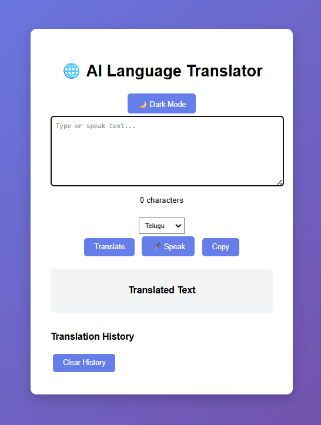
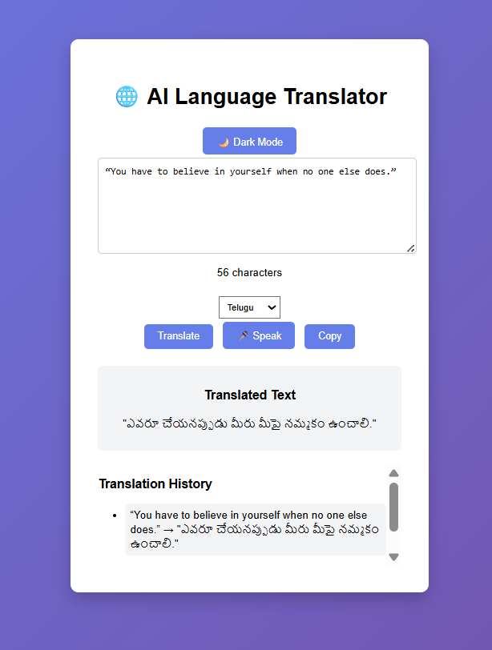
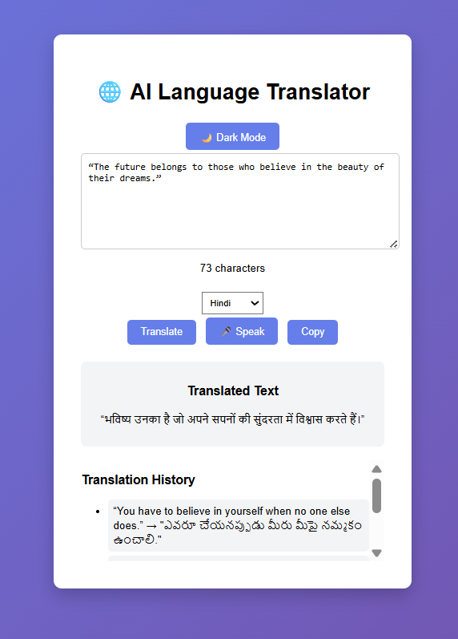

# 🌍 AI Language Translator

An AI-powered web application that translates text between multiple languages instantly. Built using Python Flask with a simple and user-friendly interface.

## 🚀 Features
- Translate text into multiple languages
- Fast and real-time translation
- Simple UI

## 🛠️ Technologies Used
- Python
- Flask
- HTML, CSS

## 📸 Screenshots

## ▶️ Run Project
pip install -r requirements.txt  
python app.py  

## 🌐 Live Demo

Project can be run locally using:
http://127.0.0.1:5000

## 👨‍💻 Author
Ajay Goud